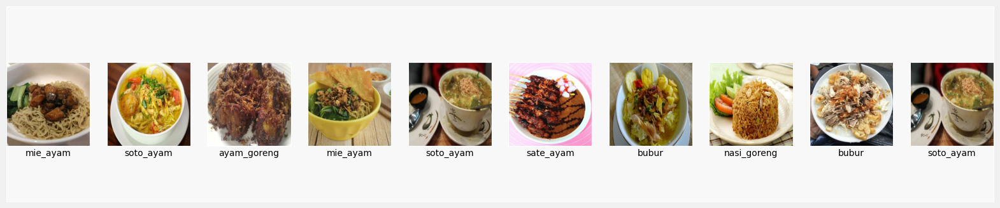
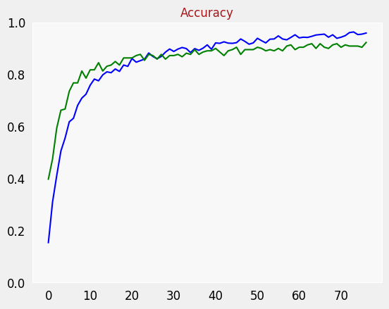
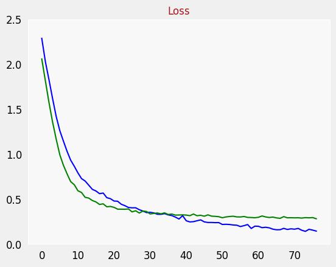
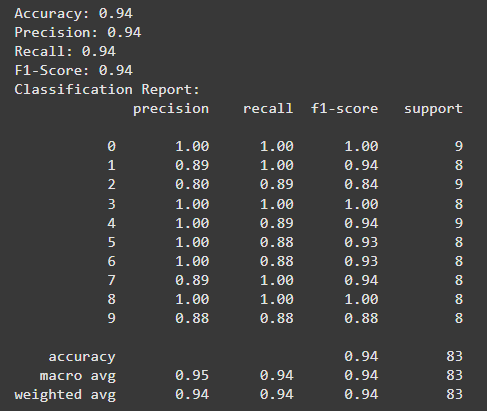

# TasteTrip Machine Learning

### Team Members:
- **Hauzan Ariq Bakri** (M009B4KY1750)
- **Agnes I Nababan** (M404B4KX0173)

## Image Classifier for Indonesian Cuisine

**TasteTrip Machine Learning** team focuses on developing a machine learning model to classify images of popular Indonesian dishes. The model is designed to recognize various food based on its visual features, providing an automated solution for food recognition through image.

### Food Labels (Total: 10):
- Bakso
- Batagor
- Bubur
- Gado-Gado
- Mie Ayam
- Nasi Goreng
- Nasi Padang
- Rawon
- Sate Ayam
- Soto Ayam

The model is trained on a diverse dataset containing 1489 images with (0.8, 0.15, 0.5) dataset split, and our aims to deliver high accuracy in real-time classification.

    
    

 

    
    

        <i><strong>0 to 9</strong> is the label mentioned before. 0 is <strong>Ayam Goreng</strong>, 1 is <strong>Bakso</strong>, and so on.</i>
    

 

---
